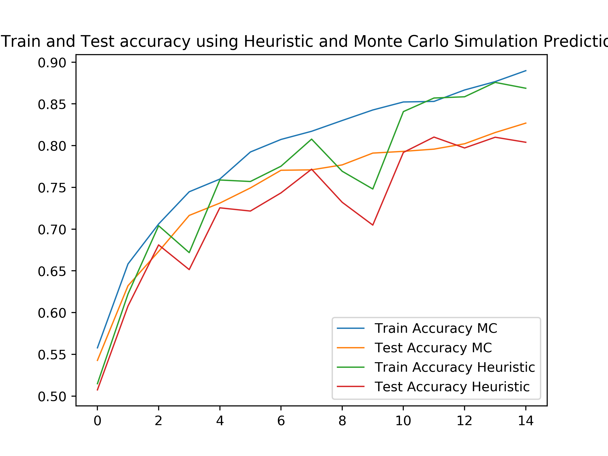

# IE 498 Homework 3

> Julius Olson

## Result

A test accuracy of `82.3%` was reached using the following parameters in combination with monte carlo. `80.4%` Was reached using the same parameters but with heuristic eval

Param      | Value
-----------|--------
Epochs   | `15`
LR       | `0.0005`
Activation | `RELU`
Monte Carlo Iterations | `10`
Data Augmentation | Random vertical and/or horizontal flips




As observed from the plots above, the process of training seemed to run a bit smoother when utlizing monte carlo simulations instead of the heurisitcs. The heuristic rule is automatically used py pytorch when the model is in "eval-mode", whereas as the monte carlo simulation was implemented by running forward propagation a number of times and using the average of the iterations as a basis for prediction. (see line 100-107 in the code).

## Implementation

The architecture of the net is as follows in the code below. The convolutional blocks are named in accordance with their order and the linear block is the final one in the architecture. Each convolutional layer is followed by batch normalization and after each "pair" of convolutional layers max pooling and dropout is applied.

```python
self.conv_block1 = nn.Sequential(
	nn.Conv2d(3, 32, kernel_size=3, padding=1),
	nn.BatchNorm2d(32),
	nn.ReLU(inplace=True),
	nn.Conv2d(32, 64, kernel_size=3, padding=1),
	nn.BatchNorm2d(64),
	nn.ReLU(inplace=True),
	nn.MaxPool2d(kernel_size=2,stride=2),
	nn.Dropout(0.05),
)

self.conv_block2 = nn.Sequential(
	nn.Conv2d(64, 128, kernel_size=5, padding=2),
	nn.BatchNorm2d(128),
	nn.ReLU(inplace=True),
	nn.Conv2d(128, 128, kernel_size=5, padding=2),
	nn.BatchNorm2d(128),
	nn.ReLU(inplace=True),
	nn.MaxPool2d(kernel_size=2,stride=2),
	nn.Dropout(0.05)
)

self.conv_block3 = nn.Sequential(
	nn.Conv2d(128, 256, kernel_size=5, padding=2),
	nn.BatchNorm2d(256),
	nn.ReLU(inplace=True),
	nn.Conv2d(256, 256, kernel_size=5, padding=2),
	nn.BatchNorm2d(256),
	nn.ReLU(inplace=True),
	nn.MaxPool2d(kernel_size=2,stride=2),
	nn.Dropout(0.1),
)

self.linear_block = nn.Sequential(
	nn.Linear(4096, 512),
	nn.ReLU(inplace=True),
	nn.Dropout(0.3),
	nn.Linear(512, 256),
	nn.ReLU(inplace=True),
	nn.Linear(256, 10),
)
```

The architecture is based on that of the network provided as an example in class. The changes made are increased filter size and number of channels in the convolutional layers. A higher probability for dropout in the later (linear) layers was also added in order to combat overfitting that was previously observed. 


## Instructions & requirements

```sh
# Run the code:

python net.py

``` 