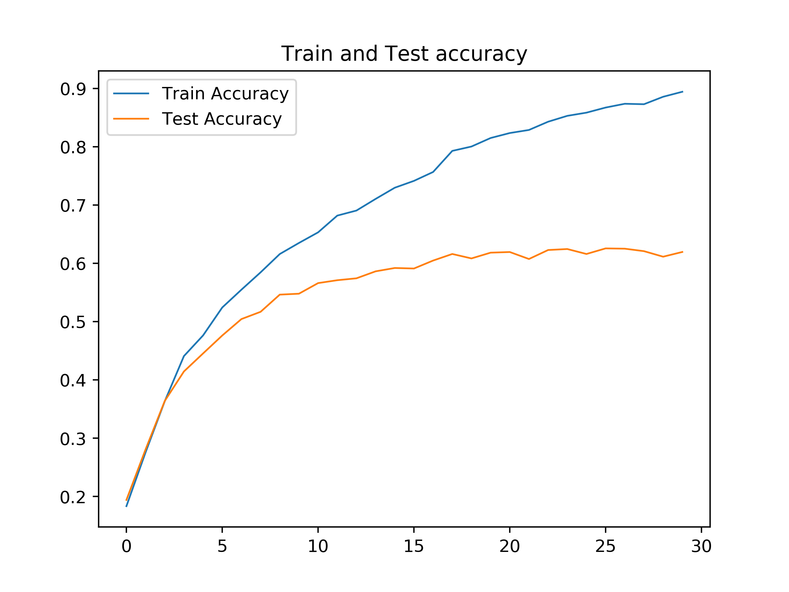
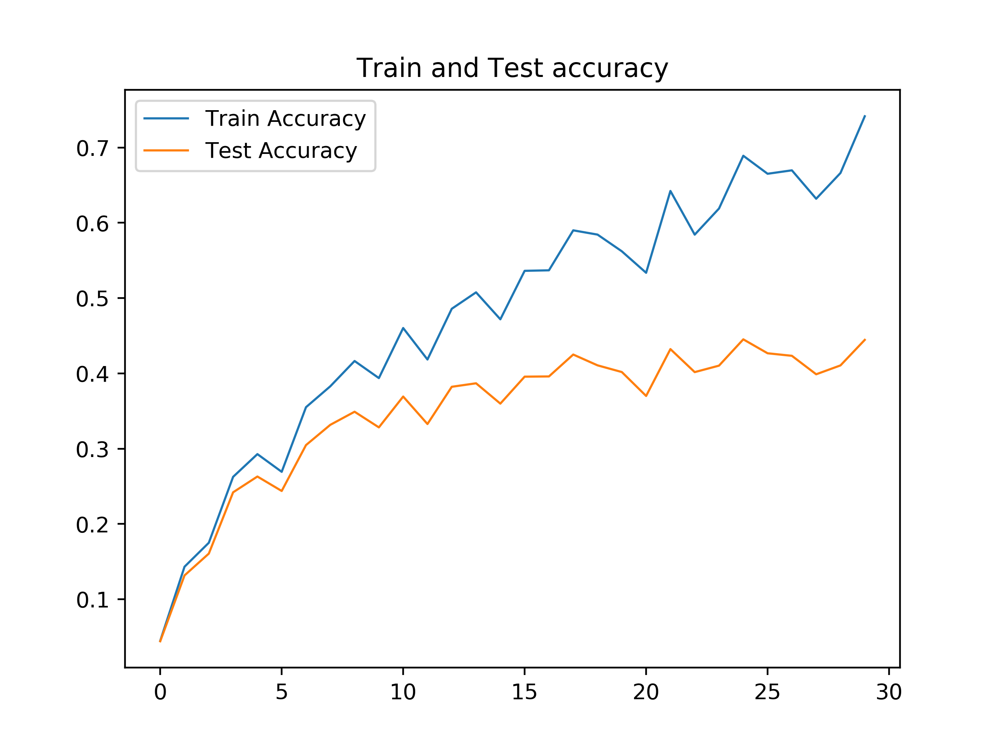
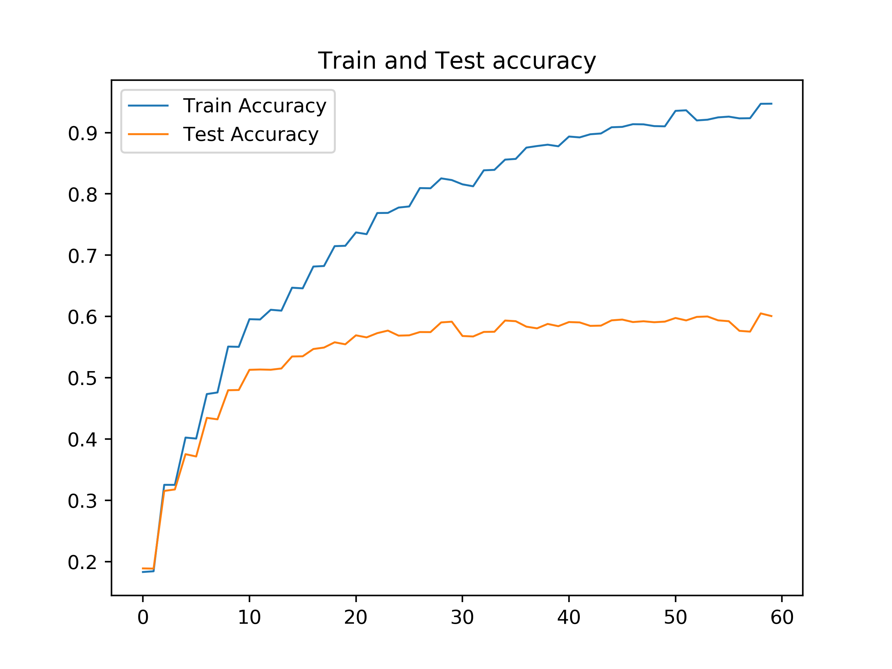
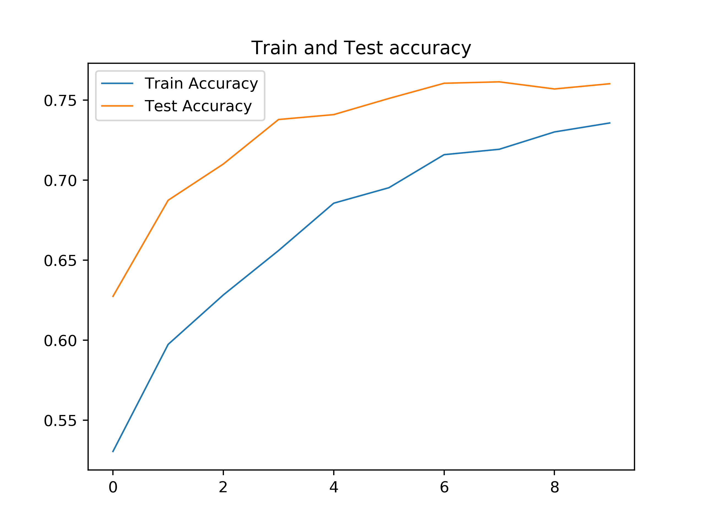

# IE 498 HW 4

> Julius Olson

## Resnet Cifar 100

Stat              | Value
------------------|--------------
Training Accuracy | 0.894
Testing Accuracy  | 0.620
Epochs            | 30

## Resnet TinyImageNet

{"Train accuracy" : 0.7414781809462916, "Test accuracy": 0.44452136075949367},

Stat              | Value
------------------|--------------
Training Accuracy | 0.741
Testing Accuracy  | 0.445
Epochs            | 30

## Distributed Training

Stat              | Value
------------------|--------------
Training Accuracy | 0.947
Testing Accuracy  | 0.601
Epochs            | 60

## Pretrained Cifar 100

Stat              | Value
------------------|--------------
Training Accuracy | 0.736
Testing Accuracy  | 0.760
Epochs            | 10

